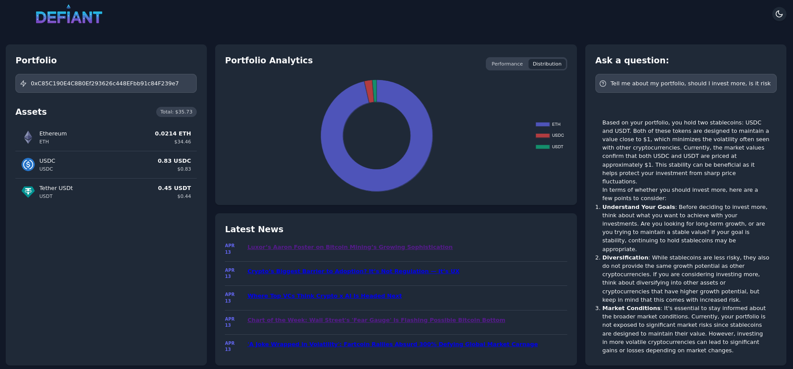
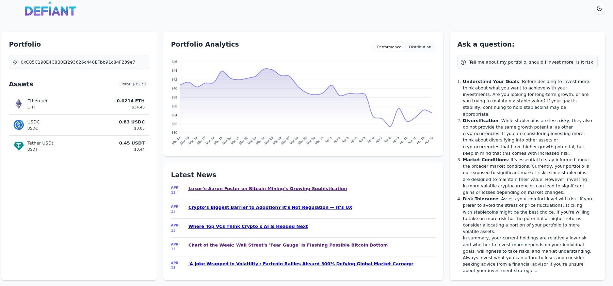

  

# Defiant: A Beginner-Focused Crypto Portfolio Assistant

Defiant is a crypto portfolio assistant designed to help beginners safely explore and understand the cryptocurrency space. By prioritizing education, user safety, and simplicity, Defiant provides a supportive environment for new users to track portfolios, understand risks, and stay updated — without the complexity or impulsive behavior enabled by typical trading platforms.

---

## 🚀 Quickstart

1. **Open the app**: [Click here to access the app](https://defiantai.me) or type defiantai.me into your browser
2. **Enter your wallet address**: Type it in and press **Enter**.
3. **View your portfolio**: Get a clear breakdown of your assets and their performance.
4. **Ask questions**: Use the AI assistant to learn more about your holdings, crypto terms, or anything else.
5. **Stay updated**: Check the **News** section for the latest crypto stories, with links to reliable sources.

---

## 🧠 Core Features

1. **📊 Portfolio Tracking**  
   - Clean dashboard of token holdings by value  
   - Dollar-value breakdowns and historical charts  
   - Token composition pie chart  

2. **🤖 AI-Powered Portfolio Q&A**  
   - Natural language feedback on portfolio risk  
   - Personalized suggestions based on real-time market data  
   - Market insights focused on fundamentals, not speculation  

3. **📰 Live Crypto News Feed**  
   - Updates from CoinDesk to help users stay informed
   - Stay ontop of recent developments that could affect your portfolio  

4. **🔒 Transaction Restrictions**  
   - No buy/sell features  
   - Inspired by *Atomic Habits* to reduce impulsive decisionmaking

5. **🎨 User-Friendly Interface**  
   - Dark/light mode  
   - Hover tooltips and animation for clarity  
   - Minimalist layout for focus and ease of use  

---

## 🏗️ System Architecture

**Tech Stack**

- **Frontend:** HTML, CSS, JavaScript (Vanilla)
- **Backend:** Flask (session management), FastAPI (async API & AI streaming)
- **AI Integration:** OpenAI API (LLMs for analysis and Q&A)
- **Blockchain/Data:** Web3, Etherscan API, CoinGecko API
- **Hosting:** Vercel (scalable, CI/CD-ready, edge delivery)

**Design Choices**

- No frontend frameworks to reduce size and increase compatibility  
- FastAPI + Flask for optimized speed and session handling  
- OpenAI enables simplified explanations and pattern detection  
- Web3 + APIs = transparent, real-time blockchain interaction  

---

## 👥 Target Audience

Defiant is built for:
- Users new to crypto and blockchain  
- Individuals seeking safe, educational tools  
- People overwhelmed by the complexity of crypto exchanges  
- Those looking to gradually build understanding  

---

## 📸 Demo

>   
> _Figure 1: Homepage with portfolio overview_
>
>
>   
> _Figure 2: Light Mode Homepage with portfolio overview_

---

## 🔐 Philosophy

Defiant is a **training ground** for users to learn responsible trading in a safe environment. By focusing on **education over execution**, we help users build the confidence and knowledge needed for more advanced platforms later on.

---

## 📦 Deployment

Defiant is hosted on **Google Cloud** for:
- Low-latency edge delivery  
- Auto-scaling with usage  
- Simple deployment with Docker  

---

## 📚 Resources

- [OpenAI API](https://platform.openai.com/docs)
- [CoinGecko API](https://www.coingecko.com/en/api)
- [Etherscan API](https://docs.etherscan.io/)
- [Web3.js Documentation](https://web3js.readthedocs.io/)

---

## 🧩 Future Plans

- Interactive onboarding/tutorial flow  
- Community Q&A with vetted experts  
- Forum for beginners to chat with and learn from other users
